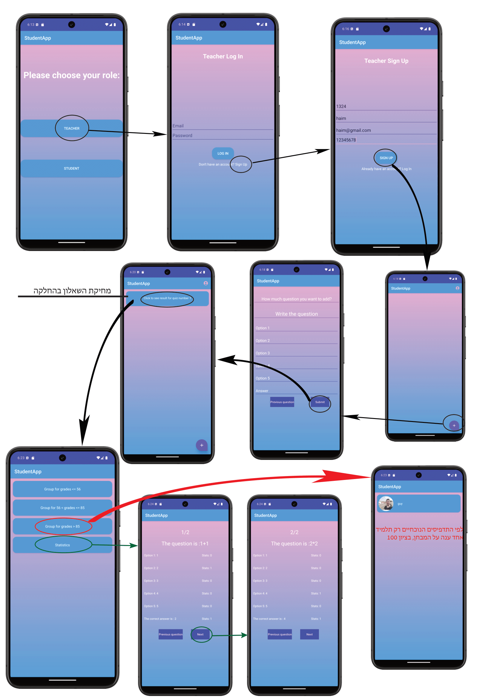
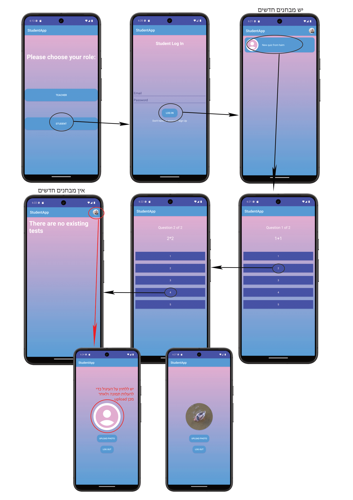

# Intelligent Student Grouping System

This project is an intelligent system for grouping students into small, homogeneous learning groups, built as an Android application. The system allows teachers or lecturers to divide students into groups based on their knowledge level, using answers to multiple-choice questions.

The system analyzes students' answers and assigns them to tailored learning groups, enabling more effective learning. In this version, the system divides students into three groups based on their scores on a quiz.

Each user can set a profile picture for easy identification by the teacher.

## Main Features
- Teachers can input multiple-choice questions along with the correct answer.
- Students log into the system and answer the questions.
- The system analyzes the students' scores based on their answers.
- The teacher receives a list of student groups and statistics on their answers based on quiz scores.

## Student Grouping
The students are divided into three groups based on their scores in the quiz:
1. **Students with a score below 56**.
2. **Students with a score between 56 and 85**.
3. **Students with a score above 85**.

## Answer Statistics
For each multiple-choice question, the system analyzes the responses by counting the number of students who chose each answer.

## How it Works
1. The teacher inputs multiple-choice questions with the correct answers.
2. Students join the system and answer the questions.
3. The system calculates the score for each student based on their answers.
4. The teacher receives the grouping of students and statistical insights about their answers.

## Installation and Usage
To run the application:

1. Clone the repository:
   ```bash
   git clone https:/github.com/haimhubara/StudentGroupDivisionSystem.git

## Screenshots
Here are some screenshots of the app:




